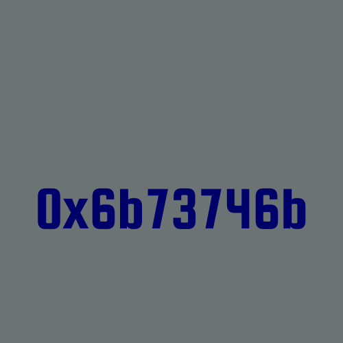

# The 0x6b73746b Programming Language

Based on Robert Nystrom's "Crafting Interpreters" book https://craftinginterpreters.com/ and the Lox Language

## Log

This README is also a log of how the language was built and what I learn during this. It serves me as a notes to memorize new things better and be able to get back to them easier

**self-hosting** - it's when a compiles of language X is written in language X

**bootstrapping** - it's when you use a language Y to compile a compiler of language X, which now can compile compilers for language X, so a former compiler of language Y is not needed anymore

language is too long word for this log, I replace it with lang since now

steps of programming language compilation:
1. **scanning** (lexing, lexical analysis) - take text, output text divided on meaningful tokens like "function", "(", "'A'", "=" and so on; we get syntax as an output here
2. **parsing** - organize tokens into a tree (AST; abstract syntax tree; parse tree), so it becomes a binary (?) tree with top operation as a root node and two (maybe more, not sure yet) children nodes; it is a structure of meaning of tokens; **parser** discovers **syntax errors**
3. **static analysis** - gives a meaning to the syntax; 
   1. **binding (resolution)** - take an **identifier** (i.e. variable) and find its declaration and connect them; **scope** becomes important here, a declaration needs to be in a scope of a usage
   2. **type checking** for statically typed langs; discover **type errors**
   3. storing a result of static analysis:
      1. attach it to AST as additional **attributes**
      2. store them in a separate table with i.e. variable names as keys
      3. transform AST to something different
   
everything up to this point is **frontend** of compiler; it's about lang
then there's **middle end**, which is **intermediate representation** (IR) 
last is **backend**, which is about something deeper but don't know it yet

4. **intermediate representation**
   1. **control-flow graph** - representation of all possible paths in a program, shown on a graph
   2. **static single assignment** - when a value is reassigned to a variable, a variable becomes a version of the original one, so in intermediate representation there will never be more than a single declaration and a single assignment to a given variable; **use-define chain** is a data structure storing uses and definitions of a variable; for static single assignment, use-define chain stores a single element
   3. **continuation-passing style** - it's a code written in a way that a function X has a callback (function Y) as a parameter; function X doesn't return a value Z; it calls function Y with parameter Z instead; "No procedure is allowed to return to its caller - ever." ~Matt Might https://matt.might.net/articles/by-example-continuation-passing-style/
   4. **three-address code** - `a := b [operation c]`, i.e. `a := 4 + c`; more complex code might be split into a sequence of multiple three-address code instructions; three-address code notation is easier to parse to assembly than a regular code
5. **optimization** - it's possible to do optimization now, because a desired logic behind code is known; the open issue is how to implement this code as a low-level instructions (?)
   1. **constant folding**

## Author
© Copyright [Jędrzej Paweł Maczan](https://maczan.pl/). Made in [Poland](https://en.wikipedia.org/wiki/Poland), 2022